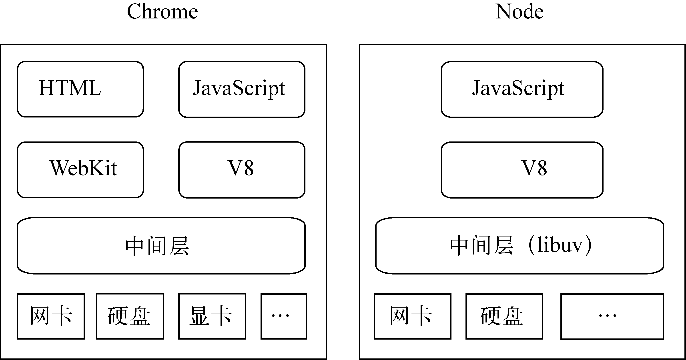

# 简单介绍

+ [为什么要学Node](#为什么要学node)
+ [简单介绍](#简单介绍)
+ [与浏览器对比](#与浏览器对比)
+ [使用场景](#使用场景)

### 简述

这里会介绍一下大家和我对Node的理解和一些基本的知识。

### 为什么要学node

1. 面试，找工作

2. 拓宽自己的知识广度，做测试，学习，更加了解前端和后台的职责。
3. 在工作中更清晰的去分辨前后端的错误，提高解决问题的速度。
4. 去了解后台到底在做什么。
5. 无论后面会不会使用Node.js开发服务端，对于前端来说有了这些网络基础之后再去学习其他编程语言 Java、python 更简单，上手更快。
6. ....

### 简单介绍

> Node.js 是一个基于 Chrome V8 引擎的 JavaScript 运行环境。

> Node.js是一个可以运行在服务器端的平台。

Node.js是JavaScript的运行时环境，不是一门语言，不是库，不是框架，是可以解析和执行JavaScript代码，就像浏览器一样，现在的JavaScript可以脱离浏览器来运行。

1. 采用事件驱动、异步编程，为网络服务而设计。
2. Node.js非阻塞模式的 I/O 处理给 Node.js带来相对低系统资源耗用下的高性能与出众的负载能力，非常适合用作依赖其他 I/O 资源的中间层服务。
3. Node.js轻量高效，可以认为是数据密集型分布式部署环境下的实时应用系统的完美解决方案。Node非常适合如下情况：在响应客户端之前，您预计可能有很高的流量，但所需的服务器端逻辑和处理不一定很多。
4. ...

### 与浏览器对比

1. 架构一样，都是基于事件驱动的异步架构
2. 浏览器通过事件驱动来服务页面
3. Node主要根据事件驱动来服务 I/O
4. Node没有html、webkit、和显卡等等UI技术支持

**浏览器js和Node中的js有什么异同**

+ 浏览器中的js
  1. 基于ESMScript规范
  2. BOM （拓展出来的用于操作页面元素的方法）
  3. DOM （拓展出来的用于操作浏览器的一些方法）。
+ node中的js
  1. 以ECMAScript为基础，并且在这个基础上拓展了一些其他的方法（非浏览器）
  2. js顶层是 window 对象，node中顶层是 global
  3. node用于服务端，所以没有DOM
  4. 有自己的模块库 (events、http、fs等)

[浏览器与Node的事件循环(Event Loop)有何区别?](https://zhuanlan.zhihu.com/p/54882306)

### 使用场景

Node.js适合用于高并发、I/O密集，少量业务逻辑的场景。

善于 I/O，不善于计算。因为Node.js最擅长的就是任务调度，如果你的业务有很多的 CPU 计算，实际上也相当于这个计算阻塞了这个单线程，就不适合Node开发。

当应用程序需要处理大量并发的I/O，而在向客户端发出响应之前，应用程序内部并不需要进行非常复杂的处理的时候，Node.js非常适合。Node.js也非常适合与web socket配合，开发长连接的实时交互应用程序。

**什么是CPU密集型、I/O密集型？**

> CPU密集型也叫计算密集型，指的是系统的硬盘、内存性能相对CPU要好很多，此时，系统运作大部分的状况是CPU Loading 100%，CPU要读/写I/O(硬盘/内存)，I/O在很短的时间就可以完成，而CPU还有许多运算要处理，CPU Loading很高
>
> 计算密集型任务的特点是要进行大量的计算，消耗CPU资源，比如计算圆周率、对视频进行高清解码等等，全靠CPU的运算能力。这种计算密集型任务虽然也可以用多任务完成，但是任务越多，花在任务切换的时间就越多，CPU执行任务的效率就越低，所以，要最高效地利用CPU，计算密集型任务同时进行的数量应当等于CPU的核心数。

> IO密集型指的是系统的CPU性能相对硬盘、内存要好很多，此时，系统运作，大部分的状况是CPU在等I/O (硬盘/内存) 的读/写操作，此时CPU Loading并不高。
>
> IO密集型，涉及到网络、磁盘IO的任务都是IO密集型任务，这类任务的特点是CPU消耗很少，任务的大部分时间都在等待IO操作完成（因为IO的速度远远低于CPU和内存的速度）。对于IO密集型任务，任务越多，CPU效率越高，但也有一个限度。常见的大部分任务都是IO密集型任务，比如Web应用。

